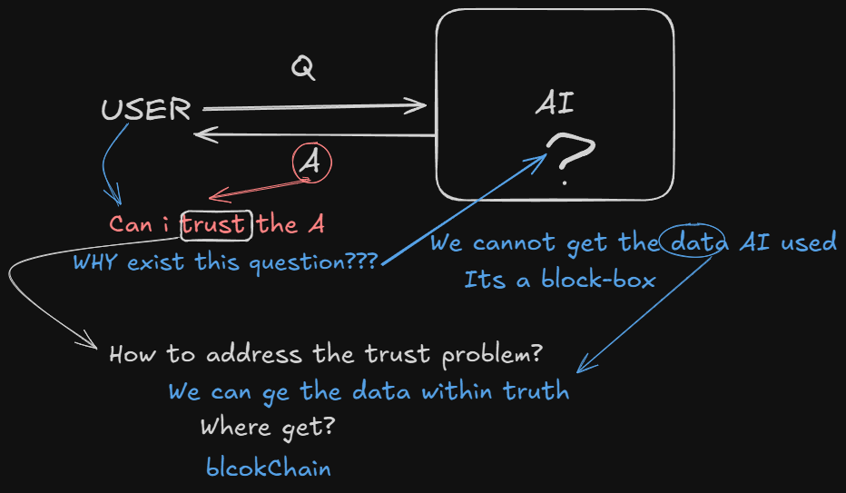
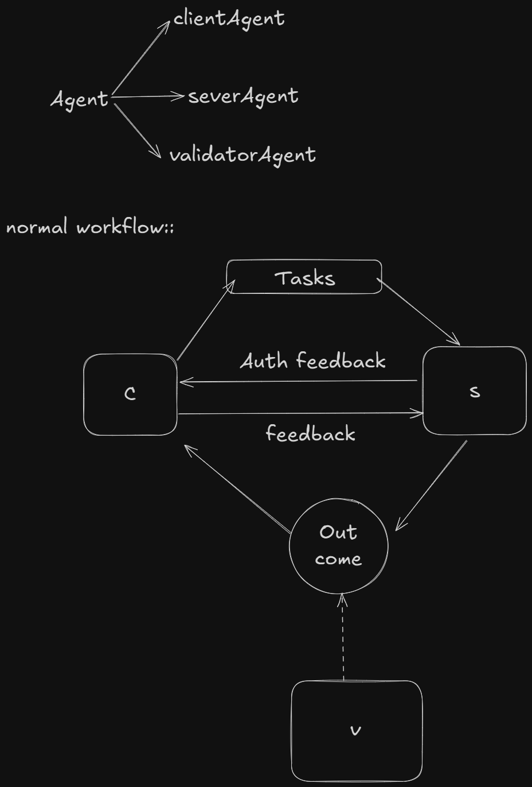

# Trustless Agents 

## 1. Why Should We Adopt Trustless Mechanisms?
Current AI Agents are predominantly centralized "black boxes"—opaque systems controlled by a few large entities (e.g., tech giants like OpenAI or Google), where users have little visibility into decision-making processes, data handling, or potential biases. This centralization creates trust barriers: without transparency, users must blindly rely on the provider for reliability, security, and ethical alignment, especially in cross-organizational multi-agent collaboration scenarios. EIP-8004 addresses this by enabling trustless interactions via blockchain, fostering an open agent economy where agents can discover and collaborate without pre-existing relationships. The motivation is to scale AI beyond silos, using pluggable trust models (e.g., reputation or validation) proportional to risk—from low-stake tasks like simple queries to high-stake ones like diagnostics—while ensuring censorship-resistant discovery and verifiable signals.

## 2. How to Solve Trustlessness?
To make AI Agents truly trustless, data and interactions must be open, verifiable, and tamper-proof, which blockchain excels at by providing immutable, decentralized ledgers. EIP-8004 solves this through three interconnected on-chain registries (Identity, Reputation, and Validation) deployed as ERC-721-based smart contracts on Ethereum Mainnet or L2s. These registries ensure data authenticity via hashes (e.g., KECCAK-256 for IPFS files), signed authorizations (EIP-191/ERC-1271), and public events for composability. Key ideas:
- **Open Data**: Agent metadata (e.g., capabilities, endpoints) is stored off-chain (IPFS/HTTP) but committed on-chain via URIs, making it browsable and auditable.
- **Truth Assurance**: Blockchain consensus verifies identities and signals (e.g., feedback scores 0-100), mitigating Sybil attacks through filtering and stake-secured validation.
- **Pluggable Models**: Choose reputation (client feedback), crypto-economic validation (staked re-execution), zkML proofs, or TEE oracles—tiered by risk.

This integration turns centralized black boxes into decentralized, verifiable systems, aligning with your point on open, true data via blockchain.

## 3. What is the Normal Workflow for a Trustless Agent?
The trustless agent workflow in EIP-8004 follows a structured, iterative process emphasizing discovery, interaction, and verification without central authority. It builds on off-chain protocols like A2A (for messaging) and MCP (for capabilities), with on-chain enforcement for trust. Here's the standard flow:

| Step | Description | Key Components |
|------|-------------|----------------|
| **1. Discovery** | Client agent (user or orchestrator) queries the Identity Registry (ERC-721) to browse agents by ID. Resolves `tokenURI` to an off-chain JSON file for details like endpoints (e.g., A2A URL), skills, and `supportedTrust` (e.g., "reputation"). Filter by reputation/validation summaries from other registries. | Identity Registry; Global ID: `(eip155, chainId, registryAddr, agentId)`. |
| **2. Selection & Interaction** | Client selects a server agent based on trust signals (e.g., avg score >80). Initiates task via off-chain endpoint (e.g., A2A message for orchestration). Server executes (e.g., AI computation) and returns artifacts. | Off-chain: A2A/MCP; On-chain: Pre-check summaries. Roles: Client (requester), Server (provider). |
| **3. Feedback (Reputation Model)** | Post-task, server signs a `feedbackAuth` tuple (agentId, clientAddr, indexLimit, expiry, etc.). Client submits to Reputation Registry: `giveFeedback(score, tags, fileuri, hash, auth)`. Optional: Revoke or append responses. | Reputation Registry; Emits `NewFeedback`; Aggregates via `getSummary`. |
| **4. Validation (If Needed)** | For high-risk tasks, server (or client) requests via Validation Registry: `validationRequest(validatorAddr, agentId, requestUri, hash)`. Independent validator (e.g., staker or zk-prover) re-executes/verifies and responds: `validationResponse(hash, score, responseUri, tag)`. Client queries status. | Validation Registry; Emits `ValidationRequest/Response`; Models: zkML, TEE. Role: Validator (verifier). |
| **5. Iteration & Settlement** | Use aggregates for future selections. Payments orthogonal (e.g., x402 proofs in feedback files). Loop for multi-agent chains. | Cross-chain via multi-registrations; Gas sponsorship (EIP-7702) for ease. |

This workflow ensures accountability: low-trust tasks rely on reputation; high-trust add validation, all verifiable on-chain.
