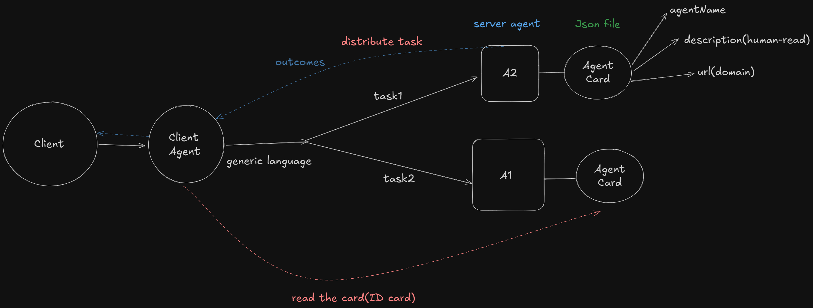

# Google:: A2A protocol

## Overview
Google's **Agent2Agent (A2A) Protocol** (announced April 9, 2025) standardizes AI agent communication over HTTP(S) with JSON-RPC 2.0. It enables discovery, task delegation, and secure collaboration across providers. Open-source on GitHub (v0.3.0).

Benefits: Interoperability, discoverability via Agent Cards, built-in security (OAuth2, API keys).

See [official spec](https://github.com/google/A2A).

## Core Components

### Agent Cards: Agent "Profiles"
JSON metadata published by server agents; fetched by clients for discovery.

**Access**: GET `https://{domain}/.well-known/agent.json`. Extended version post-auth.

**Key Fields** (JSON Schema Summary):

| Field              | Type     | Description                          | Example                  |
|--------------------|----------|--------------------------------------|--------------------------|
| `protocolVersion` | string  | Supported A2A version.              | `"0.3.0"`               |
| `name`            | string  | Agent name.                         | `"Recipe Agent"`        |
| `description`     | string  | Purpose.                            | `"Generates recipes."`  |
| `url`             | string  | Interaction endpoint.               | `"https://api.example.com/a2a/v1"` |
| `capabilities`    | object  | Features (e.g., streaming).         | `{ "streaming": true }` |
| `securitySchemes` | object  | Auth methods (OpenAPI 3.0).         | `{ "oauth": {...} }`    |
| `skills`          | array   | Abilities (ID, desc, tags).         | `[{ "id": "recipe-gen", "tags": ["cooking"] }]` |

Example JSON snippet:
```json
{
  "protocolVersion": "0.3.0",
  "name": "Travel Planner",
  "skills": [{ "id": "flight-book", "tags": ["travel"] }]
}
```

### Task Flow
User inputs natural language to client agent, which discovers servers via cards, delegates subtasks, aggregates outcomes.





**Mermaid Diagram**:

Steps: Input → Discover → Delegate (JSON-RPC) → Execute → Synthesize.

## Human Social Analogy
A2A mirrors social norms for smooth teamwork.

| A2A Element     | Social Equivalent       | Parallel                  |
|-----------------|-------------------------|---------------------------|
| Agent Card     | Resume/Business Card   | Quick fit-check.         |
| Task Distribution | Party Delegation     | Assign roles via tags.   |
| Generic Input  | Casual Chat            | No jargon; interpret.    |
| Outcomes       | Follow-Ups             | Accountability loop.     |
| Security       | ID Checks/NDAs         | Trust before sharing.    |

Like a networking event: Host (client agent) scouts profiles and divides labor.

## Implementation
- **Server**: Serve card at `/.well-known/agent.json`; handle JSON-RPC.
- **Client**: Fetch/parse cards; route tasks.
- **Python Snippet**:
  ```python
  import requests
  card = requests.get("https://example.com/.well-known/agent.json").json()
  print(card["skills"])
  ```

## Conclusion
A2A enables scalable AI "social networks" via standardized etiquette. Experiment via GitHub.
What is protocol ---> It's just rules in AI as same as rules in human society.What is Protocol ---> It's just rules in AI as same as rules in human society.